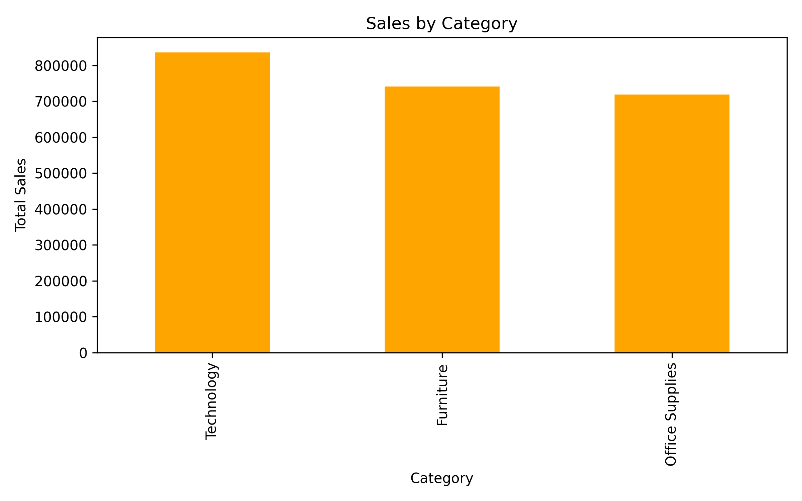
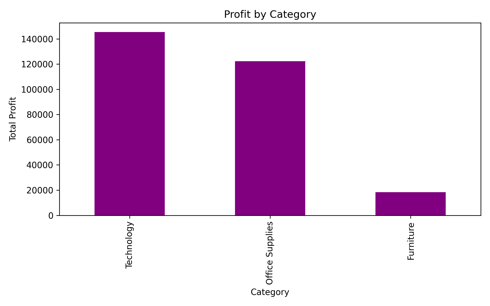
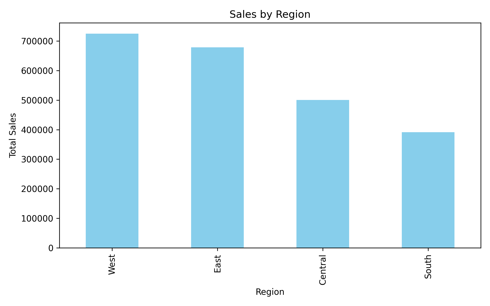
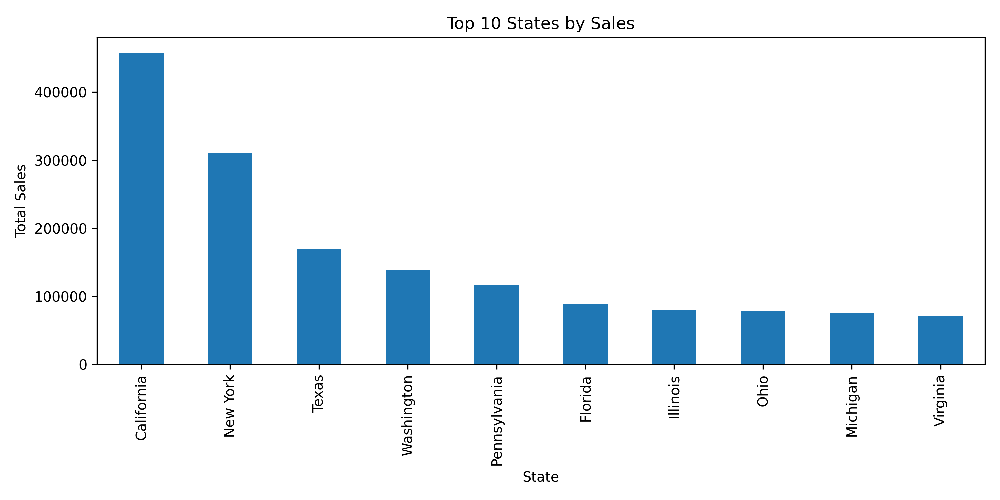
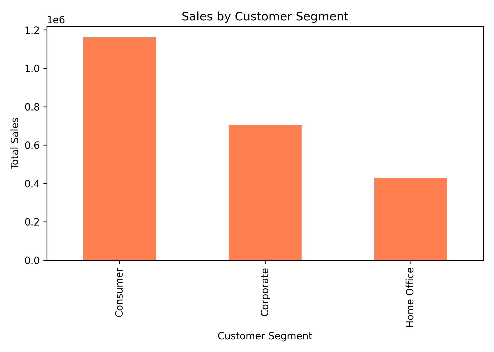
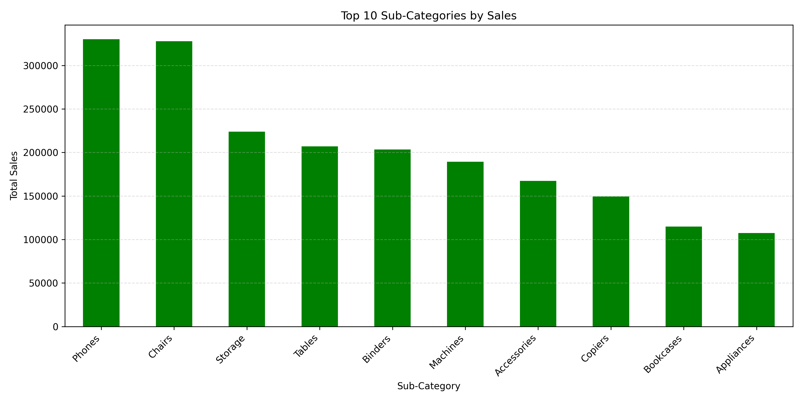
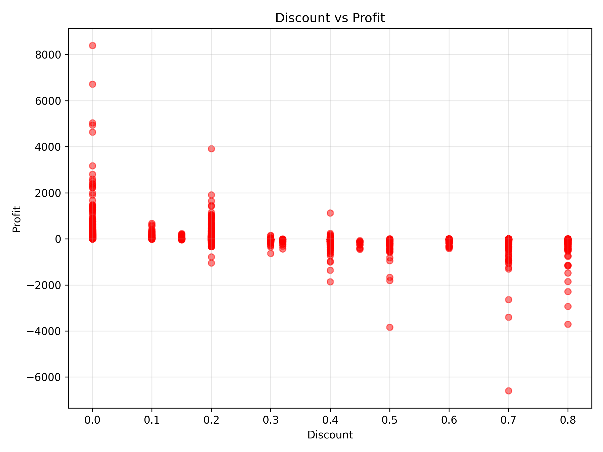

# Superstore Sales Analysis

## Project Overview

This project analyzes the Sample Superstore dataset using Python to discover sales trends, customer behavior, regional performance, and profitability.

---

## Tools Used

- Python
- Pandas
- Matplotlib
- Google Colab

---

## Dataset

- SampleSuperstore.csv

---

## Project Tasks

- Data Cleaning
- Duplicate Rows Check
- Descriptive Statistics
- Top 10 States by Sales
- Sales by Category
- Profit by Category
- Sales by Region
- Sales by Customer Segment
- Top 10 Subcategories
- Discount vs Profit Analysis

---

## Key Findings

- California achieved the highest sales.
- Technology generated the highest revenue.
- Furniture had the lowest profit despite strong sales.
- Consumer customers generated the highest sales.
- Higher discounts were associated with lower profits.
- The West region had the strongest sales performance.

---

## Business Recommendations

- Increase investment in Technology products.
- Review discount strategies to improve profitability.
- Improve Furniture pricing strategy.
- Focus marketing campaigns on Consumer customers.
- Expand successful sales strategies from the West region.

---

# Project Visualizations

## Sales by Category

---

## Profit by Category

---

## Sales by Region

---

## Top 10 States by Sales

---

## Sales by Customer Segment

---

## Top 10 Subcategories

---

## Discount vs Profit

---

## Files

- Superstore_Sales_Analysis.ipynb
- SampleSuperstore.csv

---

## Author

**Shaikah Alajmi**
